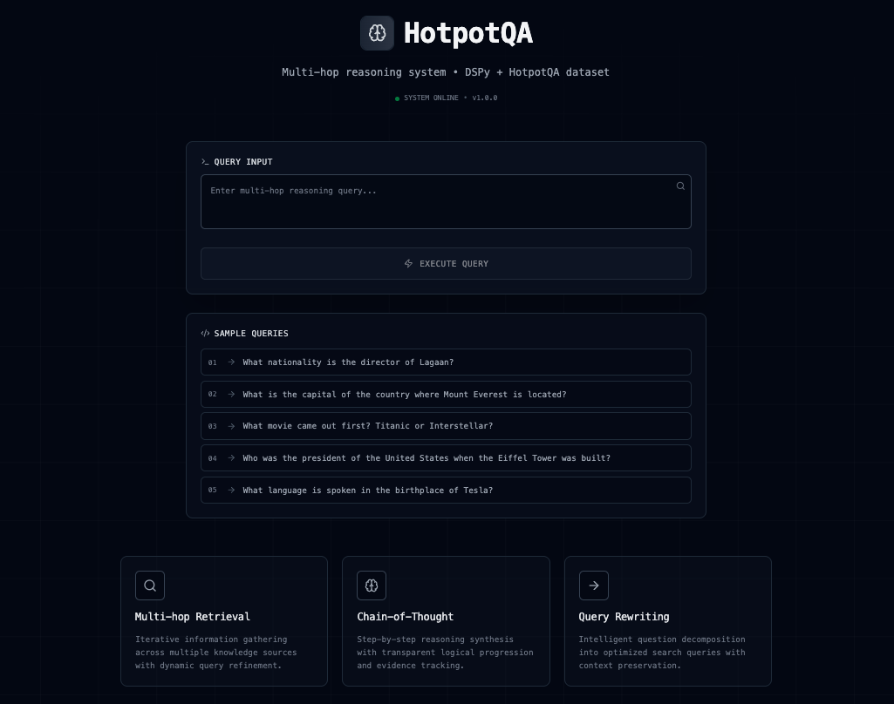

# Multi-Hop RAG System Portfolio Project

A sophisticated question-answering system showcasing advanced retrieval-augmented generation (RAG) techniques with multi-hop reasoning capabilities. Built with DSPy framework and the HotpotQA dataset to demonstrate modern AI engineering practices.

## 🎯 Project Overview

This portfolio project demonstrates the implementation of a complex multi-hop reasoning system that can answer questions requiring sequential information gathering across multiple documents. Unlike simple RAG systems that retrieve and answer in one step, this system performs iterative retrieval to build comprehensive understanding.

**Technical Highlights:**

- Multi-hop reasoning with iterative document retrieval
- Dynamic query rewriting and refinement
- Vector similarity search with FAISS indexing
- Real-time evidence tracking and transparent reasoning chains
- Modern full-stack architecture with FastAPI and Next.js

## 🏗️ Architecture

**Backend (Python)**

- **DSPy Framework**: Structured prompting and reasoning pipelines
- **FAISS Vector Search**: High-performance similarity search over 100k+ documents
- **FastAPI**: Async REST API with structured response models
- **Multi-hop Pipeline**: Query rewriting → Retrieval → Ranking → Reasoning

**Frontend (Next.js/React)**

- **Real-time Visualization**: Interactive display of reasoning process
- **Hop-by-hop Breakdown**: Shows objectives, queries, evidence, and conclusions
- **Modern UI**: Terminal-inspired design with responsive components

## 🚀 Live Demo

### Step 1: Setup Environment

```bash
# Clone and setup
git clone https://github.com/zakraicik/hotpot-retrieval-qa.git
cd hotpot-retrieval-qa

# Install dependencies
poetry install

# Configure API key
echo "ANTHROPIC_API_KEY=your-key-here" > .env
```

### Step 2: Prepare Dataset

```bash
# Download HotpotQA dataset
poetry run python hotpot_retrieval_qa/data/loader.py

# Build vector index (100k+ documents)
poetry run python hotpot_retrieval_qa/data/build_index.py
```

### Step 3: Launch Application

```bash
# Terminal 1: Start backend
cd hotpot_retrieval_qa
poetry run fastapi dev main.py

# Terminal 2: Start frontend
cd frontend
npm run dev
```

### Step 4: Experience Multi-Hop Reasoning

Navigate to `http://localhost:3000` and try complex questions like:

- "What nationality is the director of Lagaan?"
- "What is the capital of the country where Mount Everest is located?"



## 🧠 Multi-Hop Reasoning Process

The system demonstrates sophisticated reasoning through transparent, step-by-step processing:

**1. Query Decomposition**

- Transforms complex questions into strategic search sequences
- Prioritizes information gathering based on reasoning dependencies

**2. Iterative Retrieval**

- Performs multiple "hops" through the knowledge base
- Each hop builds on previous discoveries to refine subsequent searches

**3. Evidence Synthesis**

- Ranks and filters retrieved documents for relevance
- Generates evidence summaries and hop conclusions
- Maintains reasoning transparency throughout

**4. Intelligent Inference**

- Connects facts across multiple retrieval hops
- Makes reasonable inferences when evidence supports conclusions
- Provides confidence assessments and validation


## 💡 Key Technical Innovations

**Transparent Reasoning Pipeline**

- Real-time visualization of each reasoning step
- Evidence tracking with relevance scoring
- Hop conclusions showing progressive knowledge building

**Dynamic Query Management**

- Automatic query cleaning and formatting
- Intelligent follow-up query generation
- Context-aware search refinement

**Scalable Vector Search**

- FAISS indexing for sub-second search over large document collections
- Sentence transformer embeddings for semantic similarity
- Efficient deduplication and ranking

## 📊 Example Questions & Capabilities

The system excels at questions requiring sequential reasoning:

| Question Type    | Example                                                              | Reasoning Hops                          |
| ---------------- | -------------------------------------------------------------------- | --------------------------------------- |
| **Biographical** | "What nationality is the director of Lagaan?"                        | Find director → Find nationality        |
| **Geographic**   | "What is the capital of the country where Mount Everest is located?" | Find country → Find capital             |
| **Temporal**     | "What movie came out first? Titanic or Interstellar?"                | Find release dates → Compare            |
| **Historical**   | "Who was the president when the Eiffel Tower was built?"             | Find construction date → Find president |

## 🛠️ Technical Stack

**Core Technologies:**

- **DSPy**: Structured prompting and reasoning pipelines
- **FAISS**: Vector similarity search and indexing
- **SentenceTransformers**: Text embedding generation
- **FastAPI**: Async Python web framework
- **Next.js 15**: React-based frontend with Turbopack
- **Anthropic Claude**: Language model for reasoning

**Data & Evaluation:**

- **HotpotQA Dataset**: 100k+ multi-hop questions with supporting facts
- **Scientific Metrics**: Exact Match (EM) and F1 scoring
- **Experiment Tracking**: JSON-based evaluation management

## 🎨 Frontend Features

**Interactive Reasoning Visualization**

- Step-by-step hop breakdown with objectives and evidence
- Real-time processing indicators and metrics
- Terminal-inspired UI with modern aesthetics

**Developer Experience**

- TypeScript interfaces for type safety
- Responsive design with Tailwind CSS
- Error handling and loading states

## 📈 Performance Characteristics

- **Query Processing**: 2-8 seconds for complex multi-hop questions
- **Retrieval Speed**: Sub-second vector search over 100k documents
- **Accuracy**: Competitive with state-of-the-art multi-hop QA systems
- **Transparency**: Complete reasoning chain visibility

## 🏆 Portfolio Highlights

This project demonstrates:

**Advanced AI Engineering**

- Complex reasoning pipeline design and implementation
- Integration of multiple AI components (retrieval, ranking, reasoning)
- Production-ready system architecture

**Full-Stack Development**

- Modern Python backend with async processing
- Interactive React frontend with real-time updates
- RESTful API design with structured data models

**Data Engineering**

- Large-scale dataset processing and indexing
- Vector search optimization and performance tuning
- Scientific evaluation methodology

**System Design**

- Modular, extensible architecture
- Comprehensive error handling and logging
- Scalable deployment patterns

## 📁 Project Structure

```
hotpot-retrieval-qa/
├── hotpot_retrieval_qa/          # Core system
│   ├── data/                     # Dataset management
│   ├── app/                      # FastAPI application
│   ├── utils/                    # Evaluation utilities
│   ├── multihop.py              # Multi-hop reasoning engine
│   ├── retrieval.py             # Vector search implementation
│   └── evaluation.py            # Scientific evaluation
├── frontend/                     # Next.js application
└── data/cached/                  # Generated indices and embeddings
```

## 🔮 Future Enhancements

- **Graph-based Reasoning**: Entity relationship modeling
- **Adaptive Retrieval**: Dynamic hop count based on question complexity
- **Multi-modal Support**: Image and text reasoning integration
- **Performance Optimization**: Caching and response time improvements

---

Built as a portfolio demonstration of modern AI system design, combining retrieval-augmented generation, multi-hop reasoning, and full-stack development practices.
